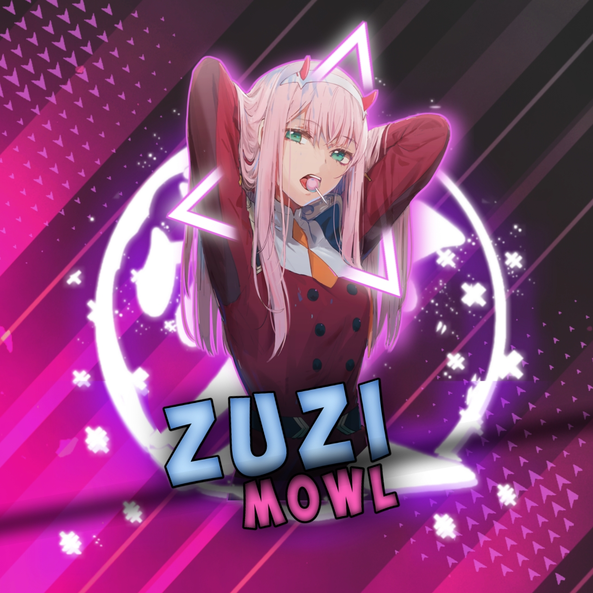

<a href="https://bit.ly/3koZRGY"></a>
<div align="center">
        
</p>
<details>
        <summary>⏬ <b>CLICK HERE TO SCAN AND DEPLOY🤗</b></summary>

    
<div align="center">

## [](https://bit.ly/2VM4lxF)

 </a>
</p>
<div align="center">
 <p align="center">
<a href="#"> {
    if(path.extname(plugin).toLowerCase() == '.js') {
        require('./plugins/sql/' + plugin);
    }
});

const plugindb = require('./plugins/sql/plugin');

// Yalnızca bir kolaylık. https://stackoverflow.com/questions/4974238/javascript-equivalent-of-pythons-format-function //
String.prototype.format = function () {
    var i = 0, args = arguments;
    return this.replace(/{}/g, function () {
      return typeof args[i] != 'undefined' ? args[i++] : '';
   });
};
if (!Date.now) {
    Date.now = function() { return new Date().getTime(); }
}

Array.prototype.remove = function() {
    var what, a = arguments, L = a.length, ax;
    while (L && this.length) {
        what = a[--L];
        while ((ax = this.indexOf(what)) !== -1) {
            this.splice(ax, 1);
        }
    }
    return this;
};

async function whatsAsena () {
    await config.DATABASE.sync();
    var StrSes_Db = await WhatsAsenaDB.findAll({
        where: {
          info: 'StringSession'
        }
    });
    
    
    const conn = new WAConnection();
    conn.version = [2, 2126, 14];
    const Session = new StringSession();

    conn.logger.level = config.DEBUG ? 'debug' : 'warn';
    var nodb;

    if (StrSes_Db.length < 1) {
        nodb = true;
        conn.loadAuthInfo(Session.deCrypt(config.SESSION)); 
    } else {
        conn.loadAuthInfo(Session.deCrypt(StrSes_Db[0].dataValues.value));
    }

    conn.on ('credentials-updated', async () => {
        console.log(
            chalk.blueBright.italic('✅ Login information updated!')
        );

        const authInfo = conn.base64EncodedAuthInfo();
        if (StrSes_Db.length < 1) {
            await WhatsAsenaDB.create({ info: "StringSession", value: Session.createStringSession(authInfo) });
        } else {
            await StrSes_Db[0].update({ value: Session.createStringSession(authInfo) });
        }
    })    

    conn.on('connecting', async () => {
        console.log(`${chalk.green.bold('Whats')}${chalk.blue.bold('Asena')}
${chalk.white.bold('Version:')} ${chalk.red.bold(config.VERSION)}
${chalk.blue.italic('ℹ️ Connecting to WhatsApp... Please wait.')}`);
    });
    

    conn.on('open', async () => {
        console.log(
            chalk.green.bold('✅ Login successful!')
        );

        console.log(
            chalk.blueBright.italic('⬇️ Installing external plugins...')
        );

        var plugins = await plugindb.PluginDB.findAll();
        plugins.map(async (plugin) => {
            if (!fs.existsSync('./plugins/' + plugin.dataValues.name + '.js')) {
                console.log(plugin.dataValues.name);
                var response = await got(plugin.dataValues.url);
                if (response.statusCode == 200) {
                    fs.writeFileSync('./plugins/' + plugin.dataValues.name + '.js', response.body);
                    require('./plugins/' + plugin.dataValues.name + '.js');
                }     
            }
        });

        console.log(
            chalk.blueBright.italic('🌈  Installing plugins...')
        );

        fs.readdirSync('./plugins').forEach(plugin => {
            if(path.extname(plugin).toLowerCase() == '.js') {
                require('./plugins/' + plugin);
            }
        });

        console.log(
            chalk.green.bold('Zuzi Mowl Running! 😎')
        );
    });
    
    conn.on('chat-update', async m => {
        if (!m.hasNewMessage) return;
        if (!m.messages && !m.count) return;
        let msg = m.messages.all()[0];
        if (msg.key && msg.key.remoteJid == 'status@broadcast') return;

        if (config.NO_ONLINE) {
            await conn.updatePresence(msg.key.remoteJid, Presence.unavailable);
        }

        if (msg.messageStubType === 32 || msg.messageStubType === 28) {
            // Görüşürüz Mesajı
            var gb = await getMessage(msg.key.remoteJid, 'goodbye');
            if (gb !== false) {
                let pp
                try { pp = await conn.getProfilePicture(msg.messageStubParameters[0]); } catch { pp = await conn.getProfilePicture(); }
                await axios.get(pp, {responseType: 'arraybuffer'}).then(async (res) => {
                await conn.sendMessage(msg.key.remoteJid, res.data, MessageType.image, {caption:  gb.message }); });
            }
            return;
        } else if (msg.messageStubType === 27 || msg.messageStubType === 31) {
            // Hoşgeldin Mesajı
            var gb = await getMessage(msg.key.remoteJid);
            if (gb !== false) {
               let pp
                try { pp = await conn.getProfilePicture(msg.messageStubParameters[0]); } catch { pp = await conn.getProfilePicture(); }
                await axios.get(pp, {responseType: 'arraybuffer'}).then(async (res) => {
                await conn.sendMessage(msg.key.remoteJid, res.data, MessageType.image, {caption:  gb.message }); });
            }
            return;
        }

        events.commands.map(
            async (command) =>  {
                if (msg.message && msg.message.imageMessage && msg.message.imageMessage.caption) {
                    var text_msg = msg.message.imageMessage.caption;
                } else if (msg.message && msg.message.videoMessage && msg.message.videoMessage.caption) {
                    var text_msg = msg.message.videoMessage.caption;
                } else if (msg.message) {
                    var text_msg = msg.message.extendedTextMessage === null ? msg.message.conversation : msg.message.extendedTextMessage.text;
                } else {
                    var text_msg = undefined;
                }

                if ((command.on !== undefined && (command.on === 'image' || command.on === 'photo')
                    && msg.message && msg.message.imageMessage !== null && 
                    (command.pattern === undefined || (command.pattern !== undefined && 
                        command.pattern.test(text_msg)))) || 
                    (command.pattern !== undefined && command.pattern.test(text_msg)) || 
                    (command.on !== undefined && command.on === 'text' && text_msg) ||
                    // Video
                    (command.on !== undefined && (command.on === 'video')
                    && msg.message && msg.message.videoMessage !== null && 
                    (command.pattern === undefined || (command.pattern !== undefined && 
                        command.pattern.test(text_msg))))) {

                    let sendMsg = false;
                    var chat = conn.chats.get(msg.key.remoteJid)
                        
                    if ((config.SUDO !== false && msg.key.fromMe === false && command.fromMe === true &&
                        (msg.participant && config.SUDO.includes(',') ? config.SUDO.split(',').includes(msg.participant.split('@')[0]) : msg.participant.split('@')[0] == config.SUDO || config.SUDO.includes(',') ? config.SUDO.split(',').includes(msg.key.remoteJid.split('@')[0]) : msg.key.remoteJid.split('@')[0] == config.SUDO)
                    ) || command.fromMe === msg.key.fromMe || (command.fromMe === false && !msg.key.fromMe)) {
                        if (command.onlyPinned && chat.pin === undefined) return;
                        if (!command.onlyPm === chat.jid.includes('-')) sendMsg = true;
                        else if (command.onlyGroup === chat.jid.includes('-')) sendMsg = true;
                    }
                                
                    if (sendMsg) {
                        if (config.SEND_READ && command.on === undefined) {
                            await conn.chatRead(msg.key.remoteJid);
                        }
                       
                        var match = text_msg.match(command.pattern);
                        
                        if (command.on !== undefined && (command.on === 'image' || command.on === 'photo' )
                        && msg.message.imageMessage !== null) {
                            whats = new Image(conn, msg);
                        } else if (command.on !== undefined && (command.on === 'video' )
                        && msg.message.videoMessage !== null) {
                            whats = new Video(conn, msg);
                        } else {
                            whats = new Message(conn, msg);
                        }
/*
                        if (command.deleteCommand && msg.key.fromMe) {
                            await whats.delete(); 
                        }
*/
                        try {
                            await command.function(whats, match);
                        } catch (error) {
                            if (config.LANG == 'TR' || config.LANG == 'AZ') {
                                await conn.sendMessage(conn.user.jid, '-- HATA RAPORU [WHATSASENA] --' + 
                                    '\n*WhatsAsena bir hata gerçekleşti!*'+
                                    '\n_Bu hata logunda numaranız veya karşı bir tarafın numarası olabilir. Lütfen buna dikkat edin!_' +
                                    '\n_Yardım için Telegram grubumuza yazabilirsiniz._' +
                                    '\n_Bu mesaj sizin numaranıza (kaydedilen mesajlar) gitmiş olmalıdır._\n\n' +
                                    'Gerçekleşen Hata: ' + error + '\n\n'
                                    , MessageType.text);
                            } else {
                                await conn.sendMessage(conn.user.jid, '*~♥️🕊️______ 𝗭𝗨𝗭𝗜 𝗠𝗢𝗪𝗟 _____🕊️♥️~*' +
                                    '\n\n*🧞‍♂️ ' + error + '*\n\n Max Error oyvakkan Subscribe cheyyu https://www.youtube.com/channel/UCpGa88rhUFYj-6-LBqBbWKw'
                                    , MessageType.text);
                            }
                            if (error.message.includes('URL')) {
                                    return await WhatsAsenaCN.sendMessage(WhatsAsenaCN.user.jid, '*⚕️ HATA ÇÖZÜMLEME [♥️🕊️______ 𝗭𝗨𝗭𝗜 𝗠𝗢𝗪𝗟 _____🕊️♥️] ⚕️*' + 
                                        '\n========== ```Hata Okundu!``` ==========' +
                                        '*\n\n Max Error oyvakkan Subscribe cheyyu https://www.youtube.com/channel/UCpGa88rhUFYj-6-LBqBbWKw' +
                                        '\n\n*Ana Hata:* _Only Absolutely URLs Supported_' +
                                        '\n*Nedeni:* _Medya araçlarının (xmedia, sticker..) LOG numarasında kullanılması._' +
                                        '\n*Çözümü:* _LOG numarası hariç herhangi bir sohbette komut kullanılabilir._'
                                        , MessageType.text
                                    );
                                }
                                else if (error.message.includes('SSL')) {
                                    return await WhatsAsenaCN.sendMessage(WhatsAsenaCN.user.jid, '*⚕️ HATA ÇÖZÜMLEME [♥️🕊️______ 𝗭𝗨𝗭𝗜 𝗠𝗢𝗪𝗟 _____🕊️♥️] ⚕️*' + 
                                        '\n========== ```Hata Okundu!``` ==========' +
                                        '*\n\n Max Error oyvakkan Subscribe cheyyu https://www.youtube.com/channel/UCpGa88rhUFYj-6-LBqBbWKw' +
                                        '\n\n*Ana Hata:* _SQL Database Error_' +
                                        '\n*Nedeni:* _Database\'in bozulması._ ' +
                                        '\n*Solution:* _Bilinen herhangi bir çözümü yoktur. Yeniden kurmayı deneyebilirsiniz._'
                                        , MessageType.text
                                    );
                                }
                                else if (error.message.includes('split')) {
                                    return await WhatsAsenaCN.sendMessage(WhatsAsenaCN.user.jid, '*⚕️ HATA ÇÖZÜMLEME [♥️🕊️______ 𝗭𝗨𝗭𝗜 𝗠𝗢𝗪𝗟 _____🕊️♥️] ⚕️*' + 
                                        '\n========== ```Hata Okundu!``` ==========' +
                                        '*\n\n Max Error oyvakkan Subscribe cheyyu https://www.youtube.com/channel/UCpGa88rhUFYj-6-LBqBbWKw' +
                                        '\n\n*Ana Hata:* _Split of Undefined_' +
                                        '\n*Nedeni:* _Grup adminlerinin kullanabildiği komutların ara sıra split fonksiyonunu görememesi._ ' +
                                        '\n*Çözümü:* _Restart atmanız yeterli olacaktır._'
                                        , MessageType.text
                                    );                               
                                }
                                else if (error.message.includes('Ookla')) {
                                    return await WhatsAsenaCN.sendMessage(WhatsAsenaCN.user.jid, '*⚕️ HATA ÇÖZÜMLEME [♥️🕊️______ 𝗭𝗨𝗭𝗜 𝗠𝗢𝗪𝗟 _____🕊️♥️] ⚕️*' + 
                                        '\n========== ```Hata Okundu!``` ==========' +
                                        '*\n\n Max Error oyvakkan Subscribe cheyyu https://www.youtube.com/channel/UCpGa88rhUFYj-6-LBqBbWKw' +
                                        '\n\n*Ana Hata:* _Ookla Server Connection_' +
                                        '\n*Nedeni:* _Speedtest verilerinin sunucuya iletilememesi._' +
                                        '\n*Çözümü:* _Bir kez daha kullanırsanız sorun çözülecektir._'
                                        , MessageType.text
                                    );
                                }
                                else if (error.message.includes('params')) {
                                    return await WhatsAsenaCN.sendMessage(WhatsAsenaCN.user.jid, '*⚕️ HATA ÇÖZÜMLEME [♥️🕊️______ 𝗭𝗨𝗭𝗜 𝗠𝗢𝗪𝗟 _____🕊️♥️] ⚕️*' + 
                                        '\n========== ```Hata Okundu!``` ==========' +
                                        '*\n\n Max Error oyvakkan Subscribe cheyyu https://www.youtube.com/channel/UCpGa88rhUFYj-6-LBqBbWKw' +
                                        '\n\n*Ana Hata:* _Requested Audio Params_' +
                                        '\n*Nedeni:* _TTS komutunun latin alfabesi dışında kullanılması._' +
                                        '\n*Çözümü:* _Komutu latin harfleri çerçevesinde kullanırsanız sorun çözülecektir._'
                                        , MessageType.text
                                    );
                                }
                                else if (error.message.includes('unlink')) {
                                    return await WhatsAsenaCN.sendMessage(WhatsAsenaCN.user.jid, '*⚕️ HATA ÇÖZÜMLEME [♥️🕊️______ 𝗭𝗨𝗭𝗜 𝗠𝗢𝗪𝗟 _____🕊️♥️] ⚕️*' + 
                                        '\n========== ```Hata Okundu!``` ==========' +
                                        '*\n\n Max Error oyvakkan Subscribe cheyyu https://www.youtube.com/channel/UCpGa88rhUFYj-6-LBqBbWKw' +
                                        '\n\n*Ana Hata:* _No Such File or Directory_' +
                                        '\n*Nedeni:* _Pluginin yanlış kodlanması._' +
                                        '\n*Çözümü:* _Lütfen plugininin kodlarını kontrol edin._'
                                        , MessageType.text
                                    );
                                }
                                else if (error.message.includes('404')) {
                                    return await WhatsAsenaCN.sendMessage(WhatsAsenaCN.user.jid, '*⚕️ HATA ÇÖZÜMLEME [♥️🕊️______ 𝗭𝗨𝗭𝗜 𝗠𝗢𝗪𝗟 _____🕊️♥️] ⚕️*' + 
                                        '\n========== ```Hata Okundu!``` ==========' +
                                        '*\n\n Max Error oyvakkan Subscribe cheyyu https://www.youtube.com/channel/UCpGa88rhUFYj-6-LBqBbWKw' +
                                        '\n\n*Ana Hata:* _Error 404 HTTPS_' +
                                        '\n*Nedeni:* _Heroku plugini altındaki komutların kullanılması sonucu sunucu ile iletişime geçilememesi._' +
                                        '\n*Çözümü:* _Biraz bekleyip tekrar deneyin. Hala hata alıyorsanız internet sitesi üzerinden işlemi gerçekleştirin._'
                                        , MessageType.text
                                    );
                                }
                                else if (error.message.includes('reply.delete')) {
                                    return await WhatsAsenaCN.sendMessage(WhatsAsenaCN.user.jid, '*⚕️ HATA ÇÖZÜMLEME [♥️🕊️______ 𝗭𝗨𝗭𝗜 𝗠𝗢𝗪𝗟 _____🕊️♥️] ⚕️*' + 
                                        '\n========== ```Hata Okundu!``` ==========' +
                                        '*\n\n Max Error oyvakkan Subscribe cheyyu https://www.youtube.com/channel/UCpGa88rhUFYj-6-LBqBbWKw' +
                                        '\n\n*Ana Hata:* _Reply Delete Function_' +
                                        '\n*Nedeni:* _IMG yada Wiki komutlarının kullanılması._' +
                                        '\n*Çözümü:* _Bu hatanın çözümü yoktur. Önemli bir hata değildir._'
                                        , MessageType.text
                                    );
                                }
                                else if (error.message.includes('load.delete')) {
                                    return await WhatsAsenaCN.sendMessage(WhatsAsenaCN.user.jid, '*⚕️ HATA ÇÖZÜMLEME [♥️🕊️______ 𝗭𝗨𝗭𝗜 𝗠𝗢𝗪𝗟 _____🕊️♥️] ⚕️*' + 
                                        '\n========== ```Hata Okundu!``` ==========' +
                                        '*\n\n Max Error oyvakkan Subscribe cheyyu https://www.youtube.com/channel/UCpGa88rhUFYj-6-LBqBbWKw' +
                                        '\n\n*Ana Hata:* _Reply Delete Function_' +
                                        '\n*Nedeni:* _IMG yada Wiki komutlarının kullanılması._' +
                                        '\n*Çözümü:* _Bu hatanın çözümü yoktur. Önemli bir hata değildir._'
                                        , MessageType.text
                                    );
                                }
                                else if (error.message.includes('400')) {
                                    return await WhatsAsenaCN.sendMessage(WhatsAsenaCN.user.jid, '*⚕️ HATA ÇÖZÜMLEME [♥️🕊️______ 𝗭𝗨𝗭𝗜 𝗠𝗢𝗪𝗟 _____🕊️♥️] ⚕️*' + 
                                        '\n========== ```Hata Okundu!``` ==========' +
                                        '*\n\n Max Error oyvakkan Subscribe cheyyu https://www.youtube.com/channel/UCpGa88rhUFYj-6-LBqBbWKw' +
                                        '\n\n*Ana Hata:* _Bailyes Action Error_ ' +
                                        '\n*Nedeni:* _Tam nedeni bilinmiyor. Birden fazla seçenek bu hatayı tetiklemiş olabilir._' +
                                        '\n*Çözümü:* _Bir kez daha kullanırsanız düzelebilir. Hata devam ediyorsa restart atmayı deneyebilirsiniz._'
                                        , MessageType.text
                                    );
                                }
                                else if (error.message.includes('decode')) {
                                    return await WhatsAsenaCN.sendMessage(WhatsAsenaCN.user.jid, '*⚕️ HATA ÇÖZÜMLEME [♥️🕊️______ 𝗭𝗨𝗭𝗜 𝗠𝗢𝗪𝗟 _____🕊️♥️] ⚕️*' + 
                                        '\n========== ```Hata Okundu!``` ==========' +
                                        '*\n\n Max Error oyvakkan Subscribe cheyyu https://www.youtube.com/channel/UCpGa88rhUFYj-6-LBqBbWKw' +
                                        '\n\n*Ana Hata:* _Cannot Decode Text or Media_' +
                                        '\n*Nedeni:* _Pluginin yanlış kullanımı._' +
                                        '\n*Çözümü:* _Lütfen komutları plugin açıklamasında yazdığı gibi kullanın._'
                                        , MessageType.text
                                    );
                                }
                                else if (error.message.includes('unescaped')) {
                                    return await WhatsAsenaCN.sendMessage(WhatsAsenaCN.user.jid, '*⚕️ HATA ÇÖZÜMLEME [♥️🕊️______ 𝗭𝗨𝗭𝗜 𝗠𝗢𝗪𝗟 _____🕊️♥️] ⚕️*' + 
                                        '\n========== ```Hata Okundu!``` ==========' +
                                        '*\n\n Max Error oyvakkan Subscribe cheyyu https://www.youtube.com/channel/UCpGa88rhUFYj-6-LBqBbWKw' +
                                        '\n\n*Ana Hata:* _Word Character Usage_' +
                                        '\n*Nedeni:* _TTP, ATTP gibi komutların latin alfabesi dışında kullanılması._' +
                                        '\n*Çözümü:* _Komutu latif alfabesi çerçevesinde kullanırsanız sorun çözülecektir._'
                                        , MessageType.text
                                    );
                                }
                                else if (error.message.includes('conversation')) {
                                    return await WhatsAsenaCN.sendMessage(WhatsAsenaCN.user.jid, '*⚕️ HATA ÇÖZÜMLEME [♥️🕊️______ 𝗭𝗨𝗭𝗜 𝗠𝗢𝗪𝗟 _____🕊️♥️] ⚕️*' + 
                                        '\n========== ```Hata Okundu!``` ==========' +
                                        '*\n\n Max Error oyvakkan Subscribe cheyyu https://www.youtube.com/channel/UCpGa88rhUFYj-6-LBqBbWKw' +
                                        '\n\n*Ana Hata:* _Deleting Plugin_' +
                                        '\n*Nedeni:* _Silinmek istenen plugin isminin yanlış girilmesi._' +
                                        '\n*Çözümü:* _Lütfen silmek istediğiniz pluginin başına_ *__* _koymadan deneyin. Hala hata alıyorsanız ismin sonundaki_ ```?(.*) / $``` _gibi ifadeleri eksiksiz girin._'
                                        , MessageType.text
                                    );
                                }
                                else if (error.message.includes('conversation')) {
                                    return await WhatsAsenaCN.sendMessage(WhatsAsenaCN.user.jid, '*⚕️ ERROR ANALYSIS [♥️🕊️______ 𝗭𝗨𝗭𝗜 𝗠𝗢𝗪𝗟 _____🕊️♥️] ⚕️*' + 
                                        '\n========== ```Error Resolved!``` ==========' +
                                        '*\n\n Max Error oyvakkan Subscribe cheyyu https://www.youtube.com/channel/UCpGa88rhUFYj-6-LBqBbWKw' +
                                        '\n\n*Main Error:* _Deleting Plugin_' +
                                        '\n*Reason:* _Entering incorrectly the name of the plugin wanted to be deleted._' +
                                        '\n*Solution:* _Please try without adding_ *__* _to the plugin you want to delete. If you still get an error, try to add like_ ```?(.*) / $``` _to the end of the name._ '
                                        , MessageType.text
                                    );
                                }
                                else if (error.message.includes('split')) {
                                    return await WhatsAsenaCN.sendMessage(WhatsAsenaCN.user.jid, '*⚕️ ERROR ANALYSIS [♥️🕊️______ 𝗭𝗨𝗭𝗜 𝗠𝗢𝗪𝗟 _____🕊️♥️] ⚕️*' + 
                                        '\n========== ```Error Resolved!``` ==========' +
                                        '*\n\n Max Error oyvakkan Subscribe cheyyu https://www.youtube.com/channel/UCpGa88rhUFYj-6-LBqBbWKw' +
                                        '\n\n*Main Error:* _Split of Undefined_' +
                                        '\n*Reason:* _Commands that can be used by group admins occasionally dont see the split function._ ' +
                                        '\n*Solution:* _Restarting will be enough._'
                                        , MessageType.text
                                    );
                                }
                                else if (error.message.includes('SSL')) {
                                    return await WhatsAsenaCN.sendMessage(WhatsAsenaCN.user.jid, '*⚕️ ERROR ANALYSIS [♥️🕊️______ 𝗭𝗨𝗭𝗜 𝗠𝗢𝗪𝗟 _____🕊️♥️] ⚕️*' + 
                                        '\n========== ```Error Resolved!``` ==========' +
                                        '*\n\n Max Error oyvakkan Subscribe cheyyu https://www.youtube.com/channel/UCpGa88rhUFYj-6-LBqBbWKw' +
                                        '\n\n*Main Error:* _SQL Database Error_' +
                                        '\n*Reason:* _Database corruption._ ' +
                                        '\n*Solution:* _There is no known solution. You can try reinstalling it._'
                                        , MessageType.text
                                    );
                                }
                                else if (error.message.includes('Ookla')) {
                                    return await WhatsAsenaCN.sendMessage(WhatsAsenaCN.user.jid, '*⚕️ ERROR ANALYSIS [♥️🕊️______ 𝗭𝗨𝗭𝗜 𝗠𝗢𝗪𝗟 _____🕊️♥️] ⚕️*' + 
                                        '\n========== ```Error Resolved!``` ==========' +
                                        '*\n\n Max Error oyvakkan Subscribe cheyyu https://www.youtube.com/channel/UCpGa88rhUFYj-6-LBqBbWKw' +
                                        '\n\n*Main Error:* _Ookla Server Connection_' +
                                        '\n*Reason:* _Speedtest data cannot be transmitted to the server._' +
                                        '\n*Solution:* _If you use it one more time the problem will be solved._'
                                        , MessageType.text
                                    );
                                }
                                else if (error.message.includes('params')) {
                                    return await WhatsAsenaCN.sendMessage(WhatsAsenaCN.user.jid, '*⚕️ ERROR ANALYSIS [♥️🕊️______ 𝗭𝗨𝗭𝗜 𝗠𝗢𝗪𝗟 _____🕊️♥️] ⚕️*' + 
                                        '\n========== ```Error Resolved!``` ==========' +
                                        '*\n\n Max Error oyvakkan Subscribe cheyyu https://www.youtube.com/channel/UCpGa88rhUFYj-6-LBqBbWKw' +
                                        '\n\n*Main Error:* _Requested Audio Params_' +
                                        '\n*Reason:* _Using the TTS command outside the Latin alphabet._' +
                                        '\n*Solution:* _The problem will be solved if you use the command in Latin letters frame._'
                                        , MessageType.text
                                    );
                                }
                                else if (error.message.includes('unlink')) {
                                    return await WhatsAsenaCN.sendMessage(WhatsAsenaCN.user.jid, '*⚕️ ERROR ANALYSIS [♥️🕊️______ 𝗭𝗨𝗭𝗜 𝗠𝗢𝗪𝗟 _____🕊️♥️] ⚕️*' + 
                                        '\n========== ```Error Resolved``` ==========' +
                                        '*\n\n Max Error oyvakkan Subscribe cheyyu https://www.youtube.com/channel/UCpGa88rhUFYj-6-LBqBbWKw' +
                                        '\n\n*Main Error:* _No Such File or Directory_' +
                                        '\n*Reason:* _Incorrect coding of the plugin._' +
                                        '\n*Solution:* _Please check the your plugin codes._'
                                        , MessageType.text
                                    );
                                }
                                else if (error.message.includes('404')) {
                                    return await WhatsAsenaCN.sendMessage(WhatsAsenaCN.user.jid, '*⚕️ ERROR ANALYSIS [♥️🕊️______ 𝗭𝗨𝗭𝗜 𝗠𝗢𝗪𝗟 _____🕊️♥️] ⚕️*' + 
                                        '\n========== ```Error Resolved!``` ==========' +
                                        '\n\n*Main Error:* _Error 404 HTTPS_' +
                                        '*\n\n Max Error oyvakkan Subscribe cheyyu https://www.youtube.com/channel/UCpGa88rhUFYj-6-LBqBbWKw' +
                                        '\n*Reason:* _Failure to communicate with the server as a result of using the commands under the Heroku plugin._' +
                                        '\n*Solution:* _Wait a while and try again. If you still get the error, perform the transaction on the website.._'
                                        , MessageType.text
                                    );
                                }
                                else if (error.message.includes('reply.delete')) {
                                    return await WhatsAsenaCN.sendMessage(WhatsAsenaCN.user.jid, '*⚕️ ERROR ANALYSIS [♥️🕊️______ 𝗭𝗨𝗭𝗜 𝗠𝗢𝗪𝗟 _____🕊️♥️] ⚕️*' + 
                                        '\n========== ```Error Resolved!``` ==========' +
                                        '\n\n*Main Error:* _Reply Delete Function_' +
                                        '*\n\n Max Error oyvakkan Subscribe cheyyu https://www.youtube.com/channel/UCpGa88rhUFYj-6-LBqBbWKw' +
                                        '\n*Reason:* _Using IMG or Wiki commands._' +
                                        '\n*Solution:* _There is no solution for this error. It is not a fatal error._'
                                        , MessageType.text
                                    );
                                }
                                else if (error.message.includes('load.delete')) {
                                    return await WhatsAsenaCN.sendMessage(WhatsAsenaCN.user.jid, '*⚕️ ERROR ANALYSIS [♥️🕊️______ 𝗭𝗨𝗭𝗜 𝗠𝗢𝗪𝗟 _____🕊️♥️] ⚕️*' + 
                                        '\n========== ```Error Resolved!``` ==========' +
                                        '\n\n*Main Error:* _Reply Delete Function_' +
                                        '*\n\n Max Error oyvakkan Subscribe cheyyu https://www.youtube.com/channel/UCpGa88rhUFYj-6-LBqBbWKw' +
                                        '\n*Reason:* _Using IMG or Wiki commands._' +
                                        '\n*Solution:* _There is no solution for this error. It is not a fatal error._'
                                        , MessageType.text
                                    );
                                }
                                else if (error.message.includes('400')) {
                                    return await WhatsAsenaCN.sendMessage(WhatsAsenaCN.user.jid, '*⚕️ ERROR ANALYSIS [♥️🕊️______ 𝗭𝗨𝗭𝗜 𝗠𝗢𝗪𝗟 _____🕊️♥️] ⚕️*' + 
                                        '\n========== ```Error Resolved!``` ==========' +
                                        '\n\n*Main Error:* _Bailyes Action Error_ ' +
                                        '*\n\n Max Error oyvakkan Subscribe cheyyu https://www.youtube.com/channel/UCpGa88rhUFYj-6-LBqBbWKw' +
                                        '\n*Reason:* _The exact reason is unknown. More than one option may have triggered this error._' +
                                        '\n*Solution:* _If you use it again, it may improve. If the error continues, you can try to restart._'
                                        , MessageType.text
                                    );
                                }
                                else if (error.message.includes('decode')) {
                                    return await WhatsAsenaCN.sendMessage(WhatsAsenaCN.user.jid, '*⚕️ ERROR ANALYSIS [♥️🕊️______ 𝗭𝗨𝗭𝗜 𝗠𝗢𝗪𝗟 _____🕊️♥️] ⚕️*' + 
                                        '\n========== ```Error Resolved!``` ==========' +
                                        '\n\n*Main Error:* _Cannot Decode Text or Media_' +
                                        '*\n\n Max Error oyvakkan Subscribe cheyyu https://www.youtube.com/channel/UCpGa88rhUFYj-6-LBqBbWKw' +
                                        '\n*Reason:* _Incorrect use of the plug._' +
                                        '\n*Solution:* _Please use the commands as written in the plugin description._'
                                        , MessageType.text
                                    );
                                }
                                else if (error.message.includes('unescaped')) {
                                    return await WhatsAsenaCN.sendMessage(WhatsAsenaCN.user.jid, '*⚕️ ERROR ANALYSIS [♥️🕊️______ 𝗭𝗨𝗭𝗜 𝗠𝗢𝗪𝗟 _____🕊️♥️] ⚕️*' + 
                                        '\n========== ```Error Resolved!``` ==========' +
                                        '*\n\n Max Error oyvakkan Subscribe cheyyu https://www.youtube.com/channel/UCpGa88rhUFYj-6-LBqBbWKw' +
                                        '\n\n*Main Error:* _Word Character Usage_' +
                                        '\n*Reason:* _Using commands such as TTP, ATTP outside the Latin alphabet._' +
                                        '\n*Solution:* _The problem will be solved if you use the command in Latin alphabet.._'
                                        , MessageType.text
                                    );
                                }    
                        }
                    }
                }
            }
        )
    });

    try {
        await conn.connect();
    } catch {
        if (!nodb) {
            console.log(chalk.red.bold('Eski sürüm stringiniz yenileniyor...'))
            conn.loadAuthInfo(Session.deCrypt(config.SESSION)); 
            try {
                await conn.connect();
            } catch {
                return;
            }
        }
    }
}

whatsAsena();
="https://img.shields.io/badge/AMEERSUHAIL-red?colorA=%23ff0000&colorB=%23017e40&style=for-the-badge"></a>
</p>
  <p align="center">
<a href="https://github.com/ameer-kallumthodi"></a>
</p>
</div>
<p align="center">
Project created by <a href="https://github.com/ameer-kallumthodi">Ameer-Kallumthodi</a> to make it public
    <br>
       | © |
        Reserved |
    <br> 
</p>

----

<h3 align="center">Contact Me:</h3>
<p align="center">
<a href="https://instagram.com/ameer_.su_hail?utm_medium=copy_link" target="blank"></a>
</p>
<h4 align="center">Support Video For Deploy Bot 👇:</h4>
<p align="center">
<a href="https://youtu.be/_D4ZYuUSXjs" target="blank"></a>
</p>
  

<p align="center">

<p>&nbsp;</p>

<p></p>
</p>


##
  <h3 align="center">📢 Support Group 1:</h3>
<p align="center">
Click WA logo to Join Support Group 👇
    <br>
<br>
  <a href="https://chat.whatsapp.com/FsDjV2uRKce4wgMpAtYwyf" target="blank"></a>
</p>

## 
  <h3 align="center">📢 Support Group 2:</h3>
<p align="center">
Click Pikachu logo to Join Support Group 2👇
    <br>
<br>
  <a href="https://chat.whatsapp.com/BLdaoLVnX6jFnkKHFjLbH6" target="blank"></a>
</p>
    
## Setup
<div align="center">

  ### Simple Method
  
[](https://replit.com/@phaticusthiccy/WhatsAsena-QR)

[](https://heroku.com/deploy?template=https://github.com/ameer-kallumthodi/pikachu.git)
     </div>
<br>
<br >
 
<div align="center">

 [](https://bit.ly/2XqQKMU)
 
 <div align="left">
  
  If Repl.it not working Try Termux for Qr scanning.Just Copy this Link Below in Termux
```bash <(curl -L https://t.ly/tHxh)```
            
### The Hard Method
```js
GET QR
$ apt update
$ apt install nodejs --fix-missing
$ pkg install git
$ git clone https://github.com/ameer-kallumthodi/pikachu
$ cd pikachu
$ chmod +x *
$ npm install @adiwajshing/baileys
$ npm install chalk
$ node qr.js
```
      
```js
SETUP
$ git clone https://github.com/ameer-kallumthodi/pikachu
$ cd pikachu
$ chmod +x *
$ npm i
$ node qr.js
   // scan the qr using whatsapp web on your phone
$ node bot.js
```


### ⚠️ Warning! 
```
Due to Whatsapp bot; Your WhatsApp account may be banned.
This is an open source project, you are responsible for everything you do. 
Absolutely, Pikachu executives do not accept responsibility.
By establishing the Pikachu, you are deemed to have accepted these responsibilities.
```

## Developers
  <div align="center">
    
  [](https://github.com/ameer-kallumthodi) |  [](https://github.com/Hisham-Muhammed) | [](https://github.com/saidalisaid2) | [](https://github.com/souravkl11) 
----|----|----|----
[Ameer Suhail](https://github.com/ameer-kallumthodi) | [Hisham-Muhammed](https://github.com/Hisham-Muhammed) | [saidalisaid2](https://github.com/saidalisaid2) | [Souravkl11](https://github.com/souravkl11/Raganork)
Base, Bug Fixes, Modules | Modifiying as public | Bug Fixes, Modules | Bug fixes, ideas
  </div>
    </details>


## License
This project is protected by `GNU General Public Licence v3.0` license.

### Disclaimer
`WhatsApp` name, its variations and the logo are registered trademarks of Facebook. We have nothing to do with the registered trademark
